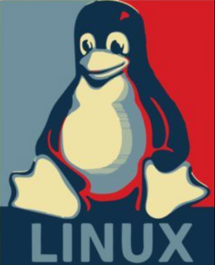

# Hola, I'm Hardik 

A result-oriented software professional having 1+ years of experience, with a proven track record in architecting robust
systems. Specialized in implementing advanced architectural practices and seamlessly integrating microservices to
elevate system efficiency. A proactive collaborator, who actively engages with cross-functional teams, contributing
significantly to product development and enhancement. Dedicated to fostering teamwork, building meaningful
relationships, and ensuring the effective execution of projects throughout the entire development lifecycle.

 

    

 

## 🔧 Skills

- Django REST Framework / Flask
- Python
- Docker
- Kubernetes
- PostgreSQL
- Node JS
- MongoDB
- C++
- Bash Scripting
- Linux OS
- Third Party Services
    - RabbitMQ
    - Redis

 

## 🌱 I’m currently learning

- Advance Python
- Advance Linux
- Websocket Programming
- Honing skills in Kubernetes
- System Design & Architecture

 

## 🚀 My Tech Blogs

> [https://hardik-tech-blogs.netlify.app/](https://hardik-tech-blogs.netlify.app/)

 

## 📫 Reach out to Me anytime

Feel free to reach out for collaborations, discussions, or just to say hello!
 
I never say no to a cup of Coffee, or discussions regarding software products and finance.

- [Mail](mailto:hardikambati99@gmail.com)
- [LinkedIn](https://www.linkedin.com/in/hardik-ambati)

 

## 💬 Quote that I live up to

 

